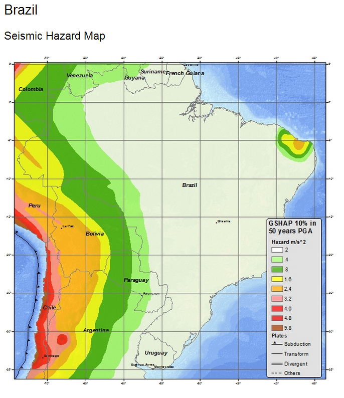

# Terremotos no Brasil #
## Desde 1950 - acima de Magnitude 5 ##

2016/12/18 - 13:30:10 - 6.4 - 201km S of Tarauaca, Brazil - [Info](https://earthquake.usgs.gov/earthquakes/eventpage/us200082an#region-info)

2015/11/27 - 00:52:54 - 5.1 - 130km SSW of Tarauaca, Brazil - [Info](https://earthquake.usgs.gov/earthquakes/eventpage/us100041lm#region-info)

2015/11/26 - 05:45:18 - 6.7 - 125km SSW of Tarauaca, Brazil - [Info](https://earthquake.usgs.gov/earthquakes/eventpage/us100041f1#region-info)

2015/11/24 - 22:50:54 - 7.6 - 211km S of Tarauaca, Brazil - [Info](https://earthquake.usgs.gov/earthquakes/eventpage/us100040x6#region-info)

2014/04/07 - 15:27:32 - 5.1 - 90km W of Tarauaca, Brazil - [Info](https://earthquake.usgs.gov/earthquakes/eventpage/usc000p90n#region-info)

2010/12/17 - 22:14:26 - 5.2 - Acre, Brazil - [Info](https://earthquake.usgs.gov/earthquakes/eventpage/usp000hr21#region-info)

2010/10/08 - 20:16:55 - 5 - Tocantins-Goias border region, Brazil - [Info](https://earthquake.usgs.gov/earthquakes/eventpage/usp000hmut#region-info)

2010/09/30 - 23:30:45 - 5.3 - Amazonas, Brazil - [Info](https://earthquake.usgs.gov/earthquakes/eventpage/usp000hme1#region-info)

2010/05/24 - 16:18:29 - 6.5 - Acre, Brazil - [Info](https://earthquake.usgs.gov/earthquakes/eventpage/usp000hd4k#region-info)

2009/06/08 - 20:20:05 - 5.4 - Acre, Brazil - [Info](https://earthquake.usgs.gov/earthquakes/eventpage/usp000gy00#region-info)

2009/02/13 - 13:18:36 - 5.2 - Peru-Brazil border region - [Info](https://earthquake.usgs.gov/earthquakes/eventpage/usp000gtwv#region-info)

2009/01/29 - 22:28:05 - 5.6 - Acre, Brazil - [Info](https://earthquake.usgs.gov/earthquakes/eventpage/usp000gt8f#region-info)

2007/07/21 - 13:27:04 - 6.1 - Acre, Brazil - [Info](https://earthquake.usgs.gov/earthquakes/eventpage/usp000fgsv#region-info)

2006/06/07 - 02:26:02 - 5.2 - Peru-Brazil border region - [Info](https://earthquake.usgs.gov/earthquakes/eventpage/usp000ejvd#region-info)

2005/05/02 - 06:04:46 - 5.1 - Peru-Brazil border region - [Info](https://earthquake.usgs.gov/earthquakes/eventpage/usp000dprb#region-info)

2005/03/23 - 21:12:00 - 5 - Mato Grosso, Brazil - [Info](https://earthquake.usgs.gov/earthquakes/eventpage/usp000djx0#region-info)

2003/07/08 - 03:25:32 - 5.2 - Amazonas, Brazil - [Info](https://earthquake.usgs.gov/earthquakes/eventpage/usp000c1yq#region-info)

2003/06/20 - 06:19:38 - 7.1 - Amazonas, Brazil - [Info](https://earthquake.usgs.gov/earthquakes/eventpage/usp000c0ag#region-info)

2003/04/27 - 22:57:44 - 6 - Acre, Brazil - [Info](https://earthquake.usgs.gov/earthquakes/eventpage/usp000bw3r#region-info)

2002/10/12 - 20:09:11 - 6.9 - Acre, Brazil - [Info](https://earthquake.usgs.gov/earthquakes/eventpage/usp000bed7#region-info)

2002/08/11 - 05:06:32 - 5.5 - Amazonas, Brazil - [Info](https://earthquake.usgs.gov/earthquakes/eventpage/usp000b9pk#region-info)

2001/08/01 - 14:32:20 - 5.4 - Peru-Brazil border region - [Info](https://earthquake.usgs.gov/earthquakes/eventpage/usp000akpa#region-info)

1998/12/10 - 08:21:14 - 5.5 - Amazonas, Brazil - [Info](https://earthquake.usgs.gov/earthquakes/eventpage/usp0008zdj#region-info)

1998/07/03 - 06:40:11 - 5.4 - Acre, Brazil - [Info](https://earthquake.usgs.gov/earthquakes/eventpage/usp0008qvw#region-info)

1998/03/10 - 23:32:43 - 5.2 - Mato Grosso, Brazil - [Info](https://earthquake.usgs.gov/earthquakes/eventpage/usp0008h9v#region-info)

1997/03/25 - 16:44:32 - 6.1 - Peru-Brazil border region - [Info](https://earthquake.usgs.gov/earthquakes/eventpage/usp0007zdt#region-info)

1997/03/07 - 09:42:23 - 5.4 - Amazonas, Brazil - [Info](https://earthquake.usgs.gov/earthquakes/eventpage/usp0007yev#region-info)

1995/04/28 - 22:29:53 - 5 - Peru-Brazil border region - [Info](https://earthquake.usgs.gov/earthquakes/eventpage/usp0006wh0#region-info)

1995/01/11 - 10:26:25 - 5.4 - Peru-Brazil border region - [Info](https://earthquake.usgs.gov/earthquakes/eventpage/usp0006r6r#region-info)

1994/11/05 - 12:05:28 - 5.6 - Peru-Brazil border region - [Info](https://earthquake.usgs.gov/earthquakes/eventpage/usp0006n5p#region-info)

1994/11/04 - 01:13:20 - 6.1 - Peru-Brazil border region - [Info](https://earthquake.usgs.gov/earthquakes/eventpage/usp0006n3b#region-info)

1993/05/06 - 13:03:18 - 6.1 - Acre, Brazil - [Info](https://earthquake.usgs.gov/earthquakes/eventpage/usp0005saj#region-info)

1990/10/17 - 15:12:18 - 5.3 - Peru-Brazil border region - [Info](https://earthquake.usgs.gov/earthquakes/eventpage/usp0004fv6#region-info)

1990/10/17 - 14:30:13 - 7 - Peru-Brazil border region - [Info](https://earthquake.usgs.gov/earthquakes/eventpage/usp0004fv5#region-info)

1989/05/05 - 18:28:39 - 7.1 - Acre, Brazil - [Info](https://earthquake.usgs.gov/earthquakes/eventpage/usp0003uxu#region-info)

1989/03/10 - 04:11:22 - 5 - Rio Grande do Norte, Brazil - [Info](https://earthquake.usgs.gov/earthquakes/eventpage/usp0003st3#region-info)

1989/02/19 - 04:23:44 - 5.2 - Peru-Brazil border region - [Info](https://earthquake.usgs.gov/earthquakes/eventpage/usp0003s2a#region-info)

1987/10/24 - 21:23:40 - 5.2 - Peru-Brazil border region - [Info](https://earthquake.usgs.gov/earthquakes/eventpage/usp00039ju#region-info)

1986/11/30 - 05:19:48 - 5.1 - Rio Grande do Norte, Brazil - [Info](https://earthquake.usgs.gov/earthquakes/eventpage/usp00030gs#region-info)

1986/04/08 - 18:02:44 - 5.7 - Peru-Brazil border region - [Info](https://earthquake.usgs.gov/earthquakes/eventpage/usp0002srz#region-info)

1986/03/26 - 22:06:57 - 6.3 - Amazonas, Brazil - [Info](https://earthquake.usgs.gov/earthquakes/eventpage/usp0002san#region-info)

1985/05/03 - 15:28:33 - 5.3 - Peru-Brazil border region - [Info](https://earthquake.usgs.gov/earthquakes/eventpage/usp0002ee8#region-info)

1985/05/01 - 13:27:56 - 6.6 - Peru-Brazil border region - [Info](https://earthquake.usgs.gov/earthquakes/eventpage/usp0002ec4#region-info)

1984/12/24 - 13:36:44 - 5.9 - Peru-Brazil border region - [Info](https://earthquake.usgs.gov/earthquakes/eventpage/usp0002acw#region-info)

1984/01/17 - 03:32:07 - 5.6 - Acre, Brazil - [Info](https://earthquake.usgs.gov/earthquakes/eventpage/usp00021an#region-info)

1983/12/25 - 05:32:40 - 5.4 - Peru-Brazil border region - [Info](https://earthquake.usgs.gov/earthquakes/eventpage/usp00020su#region-info)

1983/08/05 - 06:21:42 - 5.6 - Amazonas, Brazil - [Info](https://earthquake.usgs.gov/earthquakes/eventpage/usp0001xbu#region-info)

1983/06/02 - 20:12:50 - 6.2 - Peru-Brazil border region - [Info](https://earthquake.usgs.gov/earthquakes/eventpage/usp0001vvq#region-info)

1981/04/13 - 21:32:51 - 5 - Acre, Brazil - [Info](https://earthquake.usgs.gov/earthquakes/eventpage/usp0001d4w#region-info)

1980/11/20 - 03:29:42 - 5.1 - Ceara, Brazil - [Info](https://earthquake.usgs.gov/earthquakes/eventpage/usp0001aw9#region-info)

1980/05/16 - 04:52:53 - 5.3 - Peru-Brazil border region - [Info](https://earthquake.usgs.gov/earthquakes/eventpage/usp000178a#region-info)

1980/03/06 - 09:46:15 - 5 - Amazonas, Brazil - [Info](https://earthquake.usgs.gov/earthquakes/eventpage/usp00015uy#region-info)

1979/11/18 - 13:50:45 - 5 - Peru-Brazil border region - [Info](https://earthquake.usgs.gov/earthquakes/eventpage/usp000142t#region-info)

1978/07/11 - 12:17:07 - 5.8 - Amazonas, Brazil - [Info](https://earthquake.usgs.gov/earthquakes/eventpage/usp0000vhd#region-info)

1972/01/21 - 19:18:57 - 6.1 - Amazonas, Brazil - [Info](https://earthquake.usgs.gov/earthquakes/eventpage/iscgem777108#region-info)

1972/01/12 - 09:59:10 - 6.4 - Amazonas, Brazil - [Info](https://earthquake.usgs.gov/earthquakes/eventpage/iscgem776874#region-info)

1967/02/15 - 16:11:12 - 7 - Peru-Brazil border region - [Info](https://earthquake.usgs.gov/earthquakes/eventpage/iscgem838830#region-info)

1965/11/03 - 01:39:04 - 6.7 - Peru-Brazil border region - [Info](https://earthquake.usgs.gov/earthquakes/eventpage/iscgem852129#region-info)

1964/11/28 - 16:41:34 - 5.8 - Amazonas, Brazil - [Info](https://earthquake.usgs.gov/earthquakes/eventpage/iscgem863116#region-info)

1963/11/10 - 01:00:39 - 6.3 - Acre, Brazil - [Info](https://earthquake.usgs.gov/earthquakes/eventpage/iscgem873510#region-info)

1963/11/09 - 21:15:32 - 7.6 - Peru-Brazil border region - [Info](https://earthquake.usgs.gov/earthquakes/eventpage/iscgem17294529#region-info)

1961/08/31 - 01:48:39 - 7.2 - Peru-Brazil border region - [Info](https://earthquake.usgs.gov/earthquakes/eventpage/iscgem877295#region-info)

1961/08/19 - 05:09:51 - 7.6 - Peru-Brazil border region - [Info](https://earthquake.usgs.gov/earthquakes/eventpage/iscgem877215#region-info)

1955/01/31 - 05:03:06 - 6.3 - Mato Grosso, Brazil - [Info](https://earthquake.usgs.gov/earthquakes/eventpage/iscgem889170#region-info)

1950/07/09 - 04:40:08 - 6.8 - Acre, Brazil - [Info](https://earthquake.usgs.gov/earthquakes/eventpage/iscgem895577#region-info)

